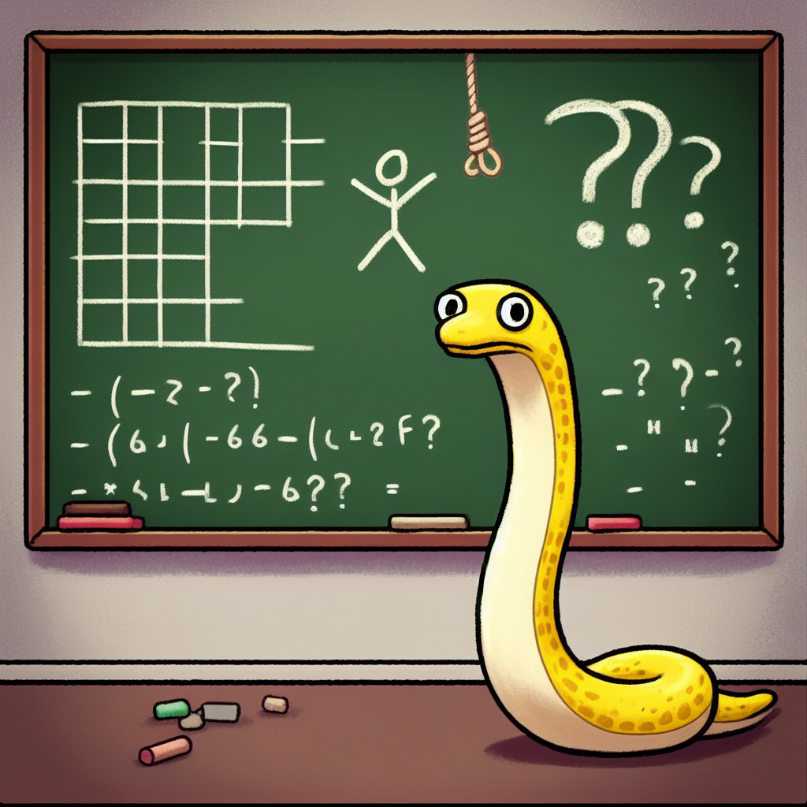
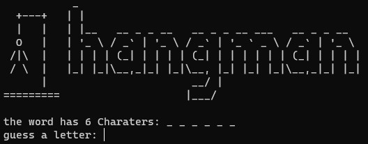

# Hangman Game

This Hangman game is a simple implementation in Python. It loads a list of words from a text file and lets the player guess the word by entering one letter at a time.

<div style="text-align:center">
  
</div>

*Image created by Dall-e*


also available in Replit:
https://replit.com/@mariaale2023/Hangman



## Prerequisites

- Python 3.x
- `hangman_ascii` module (assumed to be available in your project)

## Getting Started

1. Clone the repository or download the `hangman.py` script.
2. Make sure you have the `hangman_ascii` module available.
3. Run the script using a Python interpreter.

```bash
python hangman.py

## Acknowledgments
words taken from 
https://github.com/Xethron/Hangman/blob/master/words.txt