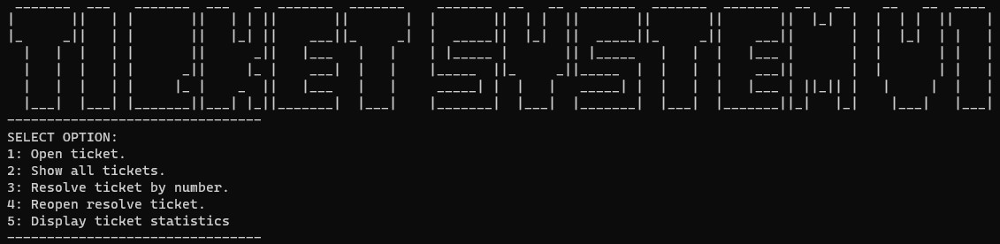

# Ticket Management System

  

also available in Replit:
https://replit.com/@mariaale2023/ticketsystem

Originally part of the Assignment in IT2016D
This Python script implements a simple ticket management system. It defines a `Ticket` class and provides a basic command-line interface for 
1. creating, 
2. reopening, 
3. listing, and 
4. resolving tickets.

## Ticket Class

The `Ticket` class has the following attributes:
- `ticket_creator`: The person creating the ticket.
- `caller_name`: The person reporting the issue.
- `caller_email`: The email address of the person reporting the issue.
- `ticket_number`: Auto-generated ticket number.
- `description`: A brief description of the issue or request.
- `status`: Current status of the ticket (Open or Resolved).
- `comments`: List of comments related to the ticket.

The class also includes methods for performing actions such as resetting passwords, solving tickets, providing feedback, submitting comments, and reopening tickets.

## Example Usage

The `main.py` is used to interact with the `ticket` class. Follow the instructions on screen to create tickets, and performs various actions on them, including printing ticket information.

### How to Run

1. Ensure you have Python installed.
2. Run the script using `python main.py` in your terminal.

### Actions
- Create a new ticket
- Reopen an existing ticket
- List all tickets
- Resolve a ticket

## ASCII Art

The script includes ASCII art in the form of a ticket at the beginning, generated from [patorjk.com/software/taag/](https://patorjk.com/software/taag/).

Feel free to use or modify this script for your ticket management needs!
