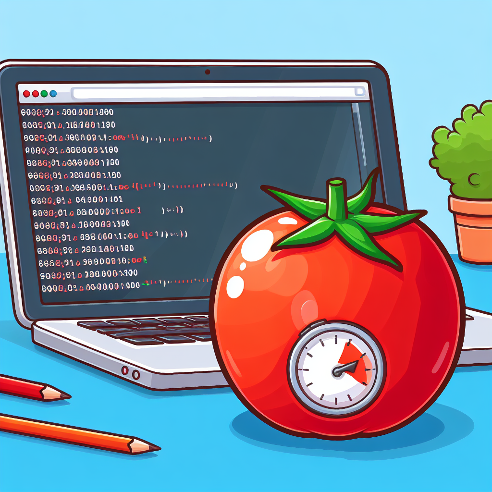
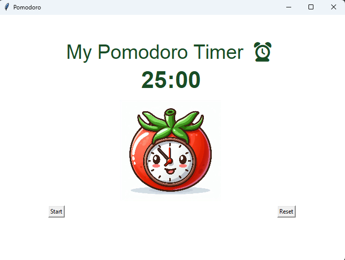

# Pomodoro Timer

*image created by dall-e*

This Pomodoro Timer is a simple implementation based on instructions from the "100 Days of Python" course. It utilizes the Tkinter library for the graphical user interface.

Created following instructions from [100 days of code](https://www.udemy.com/course/100-days-of-code)

## Replit link
https://replit.com/@mariaale2023/HeftyModestArchives#main.py

## Features
- **Work, Short Break, Long Break:** The timer alternates between work intervals, short breaks, and long breaks.
- **Checkmarks:** Keeps track of completed work intervals with checkmarks.
- **User Interface:** A clean and intuitive user interface with buttons to start and reset the timer.

## Instructions
1. Ensure you have Python installed.
2. Run the script using `python pomodoro_timer.py` in your terminal.
3. Click the "Start" button to begin the Pomodoro timer.
4. Use the "Reset" button to restart the timer.

## Usage
- The timer follows the Pomodoro technique: 25 minutes of work, 5 minutes of short break, and a longer 20-minute break after every 4 work intervals.
- Checkmarks are displayed to track completed work intervals.

## Issues
- TODO: Pressing "Start" currently causes the window width to reduce.
- TODO: Implement a pause button for additional control over the timer.

## Credits
- Tomato image created by wall-e.

Feel free to contribute or use this Pomodoro Timer for your productivity needs!
